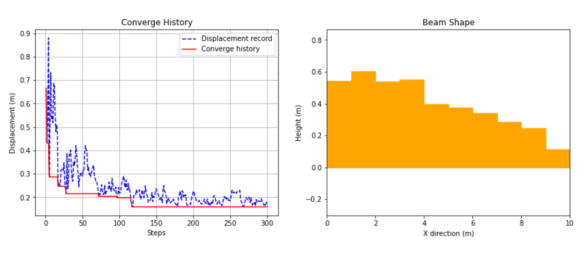
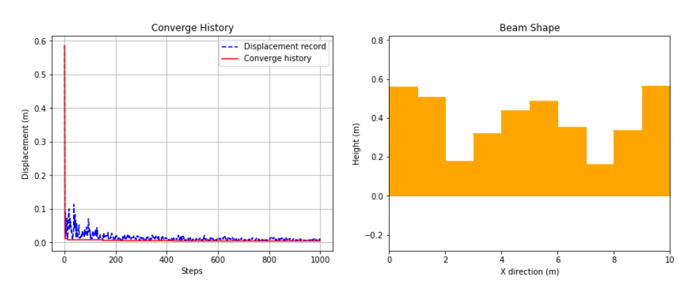
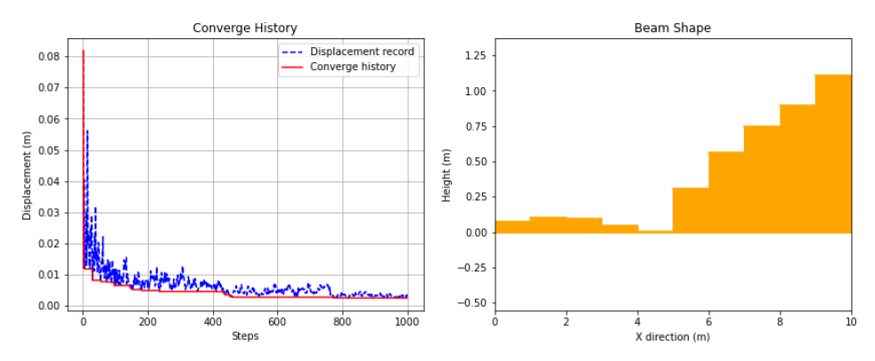

# Metaheuristic Project

## 應用 Metaheuristic 的演算法 最佳化梁斷面尺寸

### 詳細專案報告PDF: [Project](/Group13.pdf)
### 前言:
建築結構系統當中，梁與柱為主要支撐、傳遞力的結構，故其形狀、尺寸都至關重要，攸關到整棟建築物的安全性，而如何設計出經濟與安全兼顧的結構，正是結構工程師所需具備的基本能力。

本次研究主要嘗試採用演算法來分配梁結構的斷面尺寸配置，使其在一定的材料限制下能夠設計出最佳的結構。

### 研究主題:
應用模擬退火演算法(simulation annealing, SA)在固定體積以及梁寬下如何配置梁斷面(梁深)，要求在結構上某點的位移能夠最小化，進行斷面尺寸最佳化，藉此以達到材料經濟效益最大化的配置。為了簡化問題主要針對兩種簡易2D結構進行分析:

1.懸臂梁:一端固定一端為自由端的梁，受均布載重(紫色)及自由端集中力(紅色)，觀測點為梁的自由端。

2.兩端點固定梁:兩端皆固定，受均布載重及中點集中力，觀測點為梁的中點。

### 參數設定:
**結構物基本參數設定:**
  + 材料性質: E=200 (GPa)
  + 總體積: V=2 (m^3)
  + 梁長&寬: L=10 (m), W=0.5(m)
  + 集中載重: Force=100 (kN)
  + 均布載重: Load=100 (kN/m) (2D 形式)
  + 節點數(為探討的變數): \[5,7,9,11]

若已知材料性質、載重大小等設置可利用矩陣法解出線性結構節點上的位移(理論解)，[Solver](./code/Solver.py)改寫 NTU 高等結構學(呂教授) MATLAB程式碼。
  
**SA演算法參數設定:**
  + 初始梁深為平均分布
  + 每次step隨機抽取三段梁深來更換
  + 初始溫度、降溫公式、跌代次數可參考[Code](./code/SA.py "SA參數")

### Result:
當節點數n較大時(分段較多)自由度較高，雖然較不易收斂，但可得到觀測點位移下限最小，為節省篇幅，只討論n=11且成功收斂的情況。

**懸臂梁:**
得到結果較為固定，也較容易收斂，梁深最佳分布狀況為階梯式固定端向自由端遞減如下圖所示，主要因在固定端的受力較大故需材料較多。
最終分布詳細數據:
  + 總體積: 1.981 (m^3)
  + 梁深分布: \[0.54,0.60,0.54,0.55,0.40,0.37,0.34,0.28,0.24,0.11] (m)
  + 觀察點位移(自由端): 0.159 (m)

**兩端固定梁:**
得到結果主要按收斂情形會分為對稱及不對稱兩種結果，
對稱解為兩端與中間較深類似英文字母W形狀般如下圖所示，詳細數據為:
  + 總體積: 1.944 (m^3)
  + 梁深分布: \[0.56,0.51,0.18,0.32,0.44,0.48,0.35,0.16,0.33,0.56] (m)
  + 觀察點位移(自由端): 0.003 (m)

不對稱解為梁深集中在其中一固定端如下圖所示，詳細數據為:
  + 總體積: 1.973 (m^3)
  + 梁深分布: \[0.074,0.1,0.09,0.04,0.002,0.31,0.57,0.75,0.90,1.11] (m)
  + 觀察點位移(自由端): 0.003 (m)

### 結論:
本次研究成果，懸臂梁部分較為符合實際狀況，而兩端固定梁雖然在載重、支承條件都對稱的情況下，中點最小位移的最佳配置除了對稱配置外，也有可能是非對稱的結果，主要原因為一邊若梁深極淺則此結構可以逼近於懸臂梁的狀況所造成的配置，而兩種結果在位移上相差不大，顯示出使用演算法搜尋可以得到多元化結果。本次僅對2D結構進行分析，事實上結構最佳化目前經常應用在較為複雜的結構，如3D曲面、薄膜等，可以作為實際設計的參考。
