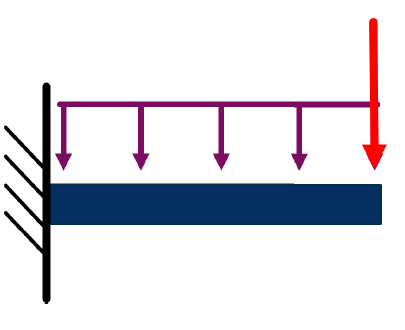
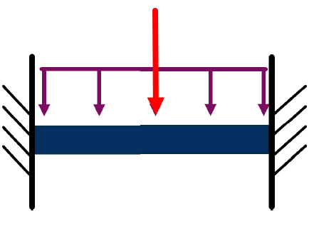

# Metaheuristic Project

## 應用任意 Metaheuristic 的演算法 嘗試解決任意工程問題
### 前言:
建築結構系統當中，梁與柱為主要支撐、傳遞力的結構，故其形狀、尺寸都至關重要，攸關到整棟建築物的安全性，而如何設計出經濟與安全兼顧的結構，正是結構工程師所需具備的基本能力。

本次研究主要嘗試採用演算法來分配梁結構的斷面尺寸配置，使其在一定的材料限制下能夠設計出最佳的結構。

### 研究主題:
應用模擬退火演算法(simulation annealing, SA)在固定體積以及梁寬下如何配置梁斷面(梁深)，要求在結構上某點的位移能夠最小化，進行斷面尺寸最佳化，藉此以達到材料經濟效益最大化的配置。為了簡化問題主要針對兩種簡易2D結構進行分析:

1.懸臂梁:一端固定一端為自由端的梁，受均布載重(紫色)及自由端集中力(紅色)，觀測點為梁的自由端。

2.兩端點固定梁:兩端皆固定，受均布載重及中點集中力，觀測點為梁的中點。

### 參數設定:
**結構物基本參數設定:**
  + 材料性質: E=200 (GPa)
  + 總體積: V=2 (m^3)
  + 梁長&寬: L=10 (m) W=0.5(m)
  + 集中載重: Force=100 (kN)
  + 均布載重: Load=100 (kN/m) (2D 形式)
  + 節點數(為探討的變數): 
